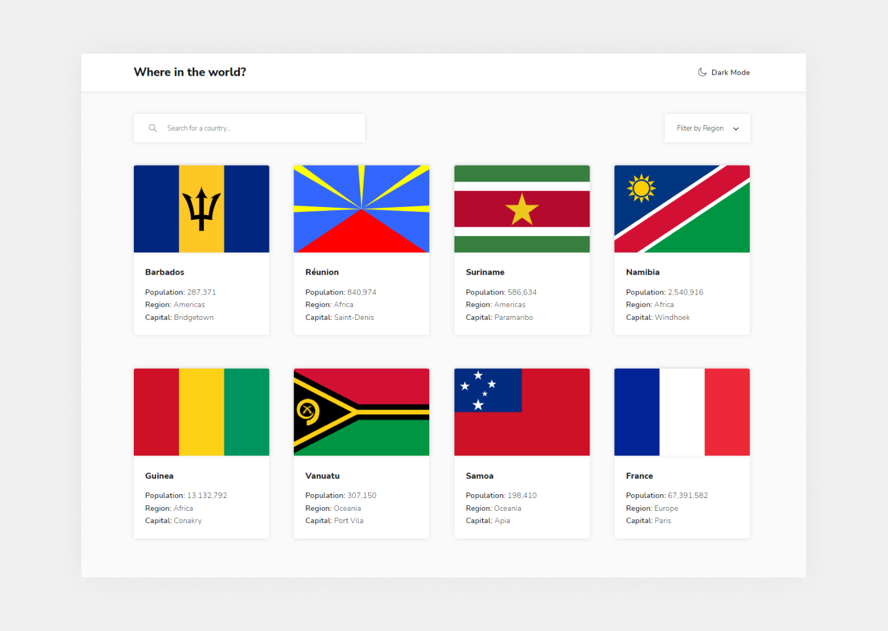

# Frontend Mentor - REST Countries API with color theme switcher solution

This is my solution to the [REST Countries API with color theme switcher challenge on Frontend Mentor](https://www.frontendmentor.io/challenges/rest-countries-api-with-color-theme-switcher-5cacc469fec04111f7b848ca). 

## Table of contents

- [Overview](#overview)
  - [The challenge](#the-challenge)
  - [Screenshot](#screenshot)
  - [Links](#links)
- [My process](#my-process)
  - [Built with](#built-with)
  - [What I learned](#what-i-learned)
<!-- - [Author](#author) -->

## Overview

### The challenge

Users should be able to:

- See all countries from the API on the homepage ✅
- Search for a country using an `input` field ✅
- Filter countries by region ✅
- Click on a country to see more detailed information on a separate page ✅
- Click through to the border countries on the detail page ✅
- Toggle the color scheme between light and dark mode *(optional)* ✅

### Screenshot

Here is the screenshot of my solution:

### Links

- Live Site URL: [Coming soon..](https://)
- Solution URL: [Will upload as soon as finished](https://)

## My process

### Built with

- Semantic HTML5 markup
- CSS custom properties + SCSS
- JavaScript
- [React.js](https://reactjs.org/)
- React Router
- [Rest Countries API](https://restcountries.com/)
- Loads of thinking 🧠

### What I learned

The main goal of taking this challenge was to improve my React.js knowledge, including the use of components, states, effects, and also React Router, links, params, etc. Most of these were new to me, so i'm kind of proud of myself for accomplishing this task (to a certain extent, of course, no one is perfect at their firsts)

Goal number two was to get more confident using APIs. Happy to say, this one has been accomplished, too.

<!--

## Author

- Website - [Add your name here](https://www.your-site.com)
- Frontend Mentor - [@yourusername](https://www.frontendmentor.io/profile/yourusername)
- Twitter - [@yourusername](https://www.twitter.com/yourusername) 

-->